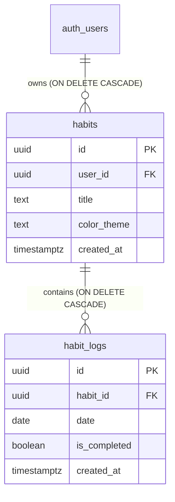

<div align="center">

# ⚡ Habit Tracker

**A modern, high-performance daily habit tracker and consistency dashboard built for discipline, focus, and long-term personal performance.**

[](https://nextjs.org/)
[](https://react.dev/)
[](https://www.typescriptlang.org/)
[](https://tailwindcss.com/)
[](https://supabase.com/)
[](LICENSE)

[Features](#-key-features) • [Tech Stack](#-tech-stack) • [Database Architecture](#-database-architecture) • [Getting Started](#-getting-started) • [Project Structure](#-project-structure)

</div>

---

## 🌟 Overview

**Habit Tracker** is a full-stack, cloud-synchronized web application crafted to turn daily routines into lasting streaks. It combines high-density habit visualization with gamified consistency analytics, real-time wave and donut metrics, custom color aesthetics, and strict habit-integrity rules.

Whether managing fitness routines, reading targets, or deep work sessions, Habit Tracker delivers an engaging interface with instant optimistic feedback, zero-lag theme transitions, and end-to-end device synchronization.

---

## ✨ Key Features

### 📅 High-Density Monthly Habit Matrix
- **Full 12-Month Calendar Grid:** Seamlessly view, navigate, and log habits across any month and year.
- **Weekly Chunking:** Automatic grouping of days into weeks with distinct color palettes and active week progression.
- **Optimistic State Toggles:** Instant checkbox feedback powered by React transitions and background Supabase database syncing.

### 🛡️ Authentic Habit Integrity (The 72-Hour Rule)
- **Future Date Lock:** Habits cannot be checked off for upcoming dates in advance—encouraging genuine daily presence.
- **72-Hour Edit Window:** Records older than 3 days (72 hours) are permanently locked to preserve historical accuracy and prevent retroactive tampering.
- **Immediate Denial Feedback:** Clicking locked cells triggers a subtle shake animation and instant informational toast without false optimistic states.

### 🎨 Fully Customizable Color Aesthetics
- **7 Curated Designer Palettes:** Cosmic Indigo, Neo Emerald, Stellar Rose, Solar Amber, Aqua Cyan, Orbit Purple, and Zero-G Blue.
- **Full Spectrum Native Color Picker:** Custom color wheel for choosing any hue, saturation, and luminance.
- **Direct Hex Code Input:** Type or paste any `#HEX` color code with instant validation.
- **Screen Eyedropper Tool:** Sample any pixel on your screen with the native browser Eyedropper API.
- **Dynamic Reactive Glow:** Modal header badges, submission buttons, and background auras react in real time to the selected theme.

### 📊 Real-Time Analytics & Charts
- **Monthly Wave Performance Chart:** Smooth SVG area chart tracking your daily consistency velocity.
- **Target Completion Donut:** Dynamic completion percentage with dynamic goal metrics.
- **Weekly Progress Bars:** Interactive visual bars detailing completed vs. possible checkmarks per week.
- **Daily Breakdown Table:** Clear daily tally of completed vs. incomplete habits across the month with high-contrast typography.
- **Top 7 Daily Habits Leaderboard:** Highlights your strongest habits ranked by completion rate.

### 🔄 Multi-Device Cloud Synchronization
- **Personalized Header Title:** Customize the tracker banner with your name (e.g., `SAARTH'S HABIT TRACKER`).
- **Cloud Metadata Persistence:** Custom titles are stored in Supabase user metadata and automatically hydrated across phones, laptops, and tablets.
- **Guest / Demo Mode:** Explore all dashboard features and mock data immediately without signing up.

### 🌓 Ultra-Smooth Dark / Light Mode
- Zero-lag CSS-variable-based theme switching with custom easing transitions.
- Ambient floating background orbs and a subtle micro-dot matrix pattern.

---

## 🛠️ Tech Stack

| Layer | Technologies |
| :--- | :--- |
| **Framework** | [Next.js 16](https://nextjs.org/) (App Router, Turbopack, React Server Components & Server Actions) |
| **Frontend Library** | [React 19](https://react.dev/), [TypeScript 5](https://www.typescriptlang.org/) |
| **Styling** | [Tailwind CSS v4](https://tailwindcss.com/), Custom Design Tokens, CSS Keyframe Animations |
| **Motion & FX** | [Framer Motion](https://www.framer.com/motion/), [Canvas Confetti](https://github.com/catdad/canvas-confetti) |
| **Icons & UI** | [Lucide React](https://lucide.dev/), [Sonner](https://sonner.emilkowal.ski/) |
| **Backend & Auth** | [Supabase](https://supabase.com/) (PostgreSQL 15+, Auth, Row Level Security, RPC functions) |
| **SSR Client** | [@supabase/ssr](https://github.com/supabase/ssr) with secure cookie-based session handling |

---

## 🗄️ Database Architecture

The backend runs on PostgreSQL via Supabase with **Row Level Security (RLS)** strictly enforcing data isolation between authenticated users.



### Database Security & RLS Policies:
- **`habits` Table:** Only the authenticated owner (`auth.uid() = user_id`) can `SELECT`, `INSERT`, `UPDATE`, and `DELETE`.
- **`habit_logs` Table:** Ownership is validated by checking the parent habit's `user_id = auth.uid()`.
- **Account Deletion RPC (`delete_user_account`):** Enables users to permanently wipe all habits, logs, and authentication records in one atomic transaction.
- **Idempotent Migration:** All policies include `DROP POLICY IF EXISTS` guards for safe, repeatable schema runs.

---

## 🚀 Getting Started

### 1. Prerequisites
- [Node.js](https://nodejs.org/) v18.18+ or v20+
- [Git](https://git-scm.com/)
- A free [Supabase](https://supabase.com/) account and project

### 2. Clone Repository
```bash
git clone https://github.com/saarthvadalia26/Habit-Tracker.git
cd Habit-Tracker
```

### 3. Install Dependencies
```bash
npm install
```

### 4. Configure Environment Variables
Create a `.env.local` file in the root directory:
```env
NEXT_PUBLIC_SUPABASE_URL=https://your-project-id.supabase.co
NEXT_PUBLIC_SUPABASE_ANON_KEY=your-supabase-anon-key
```

### 5. Set Up Database Schema
1. Open your **Supabase Dashboard** -> **SQL Editor**.
2. Copy and paste the contents of [`supabase/schema.sql`](supabase/schema.sql).
3. Click **Run** to generate tables, indexes, RLS policies, and permissions.

### 6. Run Development Server
```bash
npm run dev
```
Open [http://localhost:3000](http://localhost:3000) in your browser.

### 7. Production Build
```bash
npm run build
npm run start
```

---

## 📁 Project Structure

```plaintext
habit-tracker/
├── src/
│   ├── app/
│   │   ├── actions/               # Server Actions (Auth, Habits, Logs)
│   │   │   ├── auth.ts            # Sign in, Sign up, Delete account, Metadata sync
│   │   │   └── habits.ts          # CRUD for habits & daily completion logs
│   │   ├── globals.css            # Design tokens, keyframes, scrollbar styling
│   │   ├── layout.tsx             # Root layout with font configuration & ThemeProvider
│   │   └── page.tsx               # Server component page with SSR data fetching
│   ├── components/                # Modular UI Components
│   │   ├── AmbientBackground.tsx  # Dynamic floating ambient orbs and dot matrix
│   │   ├── AuthModal.tsx          # Login & registration modal dialog
│   │   ├── CreateHabitModal.tsx   # Habit creation modal with custom color picker
│   │   ├── DeleteAccountModal.tsx # Account wipe confirmation dialog
│   │   ├── GridCell.tsx           # Interactive 7-day habit checkbox cell
│   │   ├── HabitGrid.tsx          # 7-day routine tracker component
│   │   ├── HabitRow.tsx           # Single habit row with action buttons
│   │   ├── HeaderNav.tsx          # Navigation header with account dropdown & theme toggle
│   │   ├── NotesSection.tsx       # Local markdown notes / reflection scratchpad
│   │   └── SmartTrackerDashboard.tsx # Comprehensive monthly matrix & analytics engine
│   ├── context/
│   │   └── ThemeContext.tsx       # Fast, lag-free Light/Dark theme provider
│   ├── lib/
│   │   ├── analytics.ts           # Monthly calculations, percentages, and streaks
│   │   ├── constants.ts           # Predefined themes & dynamic color resolution
│   │   ├── dateUtils.ts           # Date math, ISO formatters, rolling day windows
│   │   ├── mockData.ts            # Sample habits for guest / preview mode
│   │   ├── monthUtils.ts          # Monthly days generator, 72h rule calculations
│   │   └── supabase/              # Supabase SSR clients (server & browser)
│   └── types/
│       └── database.types.ts      # TypeScript definitions for database entities
├── supabase/
│   └── schema.sql                 # Complete idempotent PostgreSQL schema & RLS policies
├── public/                        # Static assets and icons
├── README.md                      # Project documentation
└── package.json
```

---

## 🔒 Business Rules & Integrity Guarantees

| Rule | Enforcement | Behavior |
| :--- | :--- | :--- |
| **Future Date Restriction** | Client & Server Action | Cannot check off habits for tomorrow or any future date. |
| **72-Hour Edit Window** | Client & Server Action | Checkboxes for dates older than 3 days (72 hours) are locked to maintain authentic habit discipline. |
| **Private Data Isolation** | PostgreSQL RLS | Users can strictly access and modify their own records. |
| **Guest Exploration** | Client State | Visitors can try all tracking features in a local sandbox without signing in. |
| **Cross-Device Title** | Supabase User Metadata | Custom user tracker titles sync seamlessly across mobile, desktop, and tablets. |

---

## 🤝 Contributing

Contributions, feedback, and suggestions are welcome!

1. Fork the Project
2. Create your Feature Branch (`git checkout -b feature/AmazingFeature`)
3. Commit your Changes (`git commit -m 'Add some AmazingFeature'`)
4. Push to the Branch (`git push origin feature/AmazingFeature`)
5. Open a Pull Request

---

## 📄 License

Distributed under the **MIT License**. See [`LICENSE`](LICENSE) for more information.

---

<div align="center">
  <sub>Built with ❤️ for personal discipline and focus.</sub>
</div>