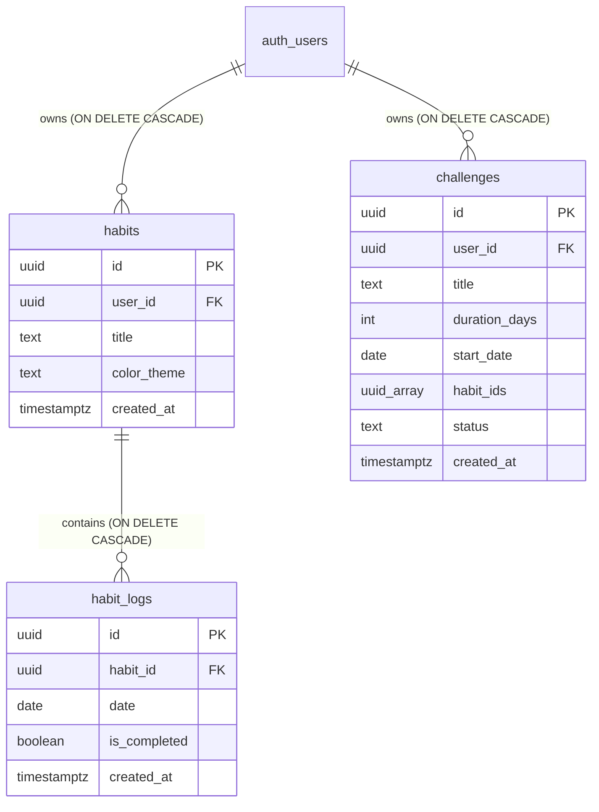

# 🎯 Habit Tracker

A modern, high-performance web-based habit tracking application designed for daily discipline, consistency analysis, and focus. Built with **Next.js 16 (App Router)**, **React 19**, **Tailwind CSS v4**, **Framer Motion**, and **Supabase (PostgreSQL)**.

---

## ⚡ Key Highlights

### 🏆 75-Day & 90-Day Challenge Engine
- **Fixed-Term Milestone Sprints:** Commit to unbroken daily discipline with dedicated challenge structures:
  - **75 Hard / 75-Day Discipline** (75 Days)
  - **90-Day Monk Mode / Deep Work** (90 Days)
  - **30-Day Consistency Sprint** (30 Days)
  - **21-Day Habit Builder** (21 Days)
  - **Custom Challenge** (Set custom name and duration between 7 and 365 days).
- **Live Days-Remaining Countdown:** Real-time day counter (`Day 14 of 75 • 61 Days Left`).
- **Milestone Badges & Rewards:** Unlock Bronze (25%), Silver (50%), Gold (75%), and Finisher Champion (100%) badges with celebratory confetti effects.
- **Challenge Habit Selection:** Select all habits or handpick specific routines that count toward your challenge.

### 📊 Matrix View & Rolling Analytics
- **Dynamic 31-Day Habit Matrix:** High-density, interactive monthly grid with responsive horizontal scrolling.
- **Continuous Cross-Month Streaks:** Calculates streaks backwards across all historical logs, preserving your 30+, 60+, and 90+ day streaks seamlessly across month boundaries.
- **72-Hour Integrity Window & Future Guard:** Prevents premature ticking of future days and locks records older than 72 hours (3 calendar days) to protect authentic habit discipline.
- **Daily Progress Wave:** Real-time Bézier spline graph displaying percentage execution day-by-day.
- **Circular Progress Metric:** Animated SVG gauge displaying overall completion based on elapsed days with mobile-optimized breathing room.
- **Top 7 Daily Leaderboard:** Highlights your most consistent routines with active flame badges.

### 🎨 Custom Color Studio
- **Palette Presets & Custom Hex Picker:** Choose from 7 curated modern tones or pick any custom color using the native color picker, hex input, eyedropper tool, or quick-select chips.
- **Dynamic Glow System:** Checked habit cells radiate custom drop shadows matched to the habit's theme.

### 📱 Multi-Device Cloud Synchronization
- **Personalized Header Title:** Customize the tracker banner with your name (e.g., `SAARTH'S HABIT TRACKER`).
- **Cloud Metadata Persistence:** Custom titles are stored in Supabase user metadata and automatically hydrated across phones, laptops, and tablets.
- **Guest / Demo Mode:** Explore all dashboard features, challenges, and mock data immediately without signing up.

### 🌓 Ultra-Smooth Dark / Light Mode
- Zero-lag CSS-variable-based theme switching with custom easing transitions.
- Ambient floating background orbs and a subtle micro-dot matrix pattern.

---

<a id="tech-stack"></a>
## 🛠️ Tech Stack

| Layer | Technologies |
| :--- | :--- |
| **Framework** | [Next.js 16](https://nextjs.org/) (App Router, Turbopack, React Server Components & Server Actions) |
| **Frontend Library** | [React 19](https://react.dev/), [TypeScript 5](https://www.typescriptlang.org/) |
| **Styling** | [Tailwind CSS v4](https://tailwindcss.com/), Custom Design Tokens, CSS Keyframe Animations |
| **Motion & FX** | [Framer Motion](https://www.framer.com/motion/), [Canvas Confetti](https://github.com/catdad/canvas-confetti) |
| **Icons & UI** | [Lucide React](https://lucide.dev/), [Sonner](https://sonner.emilkowal.ski/) |
| **Backend & Auth** | [Supabase](https://supabase.com/) (PostgreSQL 15+, Auth, Row Level Security, RPC functions) |
| **SSR Client** | [@supabase/ssr](https://github.com/supabase/ssr) with secure cookie-based session handling |

---

<a id="database-architecture"></a>
## 🗄️ Database Architecture

The backend runs on PostgreSQL via Supabase with **Row Level Security (RLS)** strictly enforcing data isolation between authenticated users.



### Database Security & RLS Policies:
- **`habits` Table:** Only the authenticated owner (`auth.uid() = user_id`) can `SELECT`, `INSERT`, `UPDATE`, and `DELETE`.
- **`habit_logs` Table:** Ownership is validated by checking the parent habit's `user_id = auth.uid()`.
- **`challenges` Table:** Strictly isolated to the owner (`auth.uid() = user_id`) with status constraints (`active`, `completed`, `abandoned`).
- **Account Deletion RPC (`delete_user_account`):** Enables users to permanently wipe all habits, challenges, logs, and authentication records in one atomic transaction.
- **Idempotent Migration:** All policies include `DROP POLICY IF EXISTS` guards for safe, repeatable schema runs.

---

<a id="getting-started"></a>
## 🚀 Getting Started

### 1. Prerequisites
- [Node.js](https://nodejs.org/) v18.18+ or v20+
- [Git](https://git-scm.com/)
- A free [Supabase](https://supabase.com/) account and project

### 2. Clone Repository
```bash
git clone https://github.com/saarthvadalia26/Habit-Tracker.git
cd Habit-Tracker
```

### 3. Install Dependencies
```bash
npm install
```

### 4. Configure Environment Variables
Create a `.env.local` file in the root directory:
```env
NEXT_PUBLIC_SUPABASE_URL=https://your-project-id.supabase.co
NEXT_PUBLIC_SUPABASE_ANON_KEY=your-supabase-anon-key
```

### 5. Set Up Database Schema
1. Open your **Supabase Dashboard** -> **SQL Editor**.
2. Copy and paste the contents of [`supabase/schema.sql`](supabase/schema.sql).
3. Click **Run** to generate tables, indexes, RLS policies, and permissions.

### 6. Run Development Server
```bash
npm run dev
```
Open [http://localhost:3000](http://localhost:3000) in your browser.

### 7. Production Build
```bash
npm run build
npm run start
```

---

<a id="project-structure"></a>
## 📂 Project Structure

```plaintext
habit-tracker/
├── src/
│   ├── app/
│   │   ├── actions/               # Server Actions (Auth, Habits, Challenges)
│   │   │   ├── auth.ts            # Sign in, Sign up, Delete account, Metadata sync
│   │   │   ├── challenges.ts      # Create, fetch, finish, and abandon challenge actions
│   │   │   └── habits.ts          # CRUD for habits & daily completion logs
│   │   ├── globals.css            # Design tokens, keyframes, scrollbar styling
│   │   ├── layout.tsx             # Root layout with font configuration & ThemeProvider
│   │   └── page.tsx               # Server component page with SSR data fetching
│   ├── components/                # Modular UI Components
│   │   ├── AmbientBackground.tsx  # Dynamic floating ambient orbs and dot matrix
│   │   ├── AuthModal.tsx          # Login & registration modal dialog
│   │   ├── ChallengeBanner.tsx    # Active challenge countdown, progress bar & milestone badges
│   │   ├── CircularGauge.tsx      # SVG progress donut gauge with responsive viewBox
│   │   ├── CreateChallengeModal.tsx # 75 Hard, 90 Monk & custom challenge creator
│   │   ├── CreateHabitModal.tsx   # Habit creation modal with custom color picker
│   │   ├── DailyProgressWaveChart.tsx # Bézier curve daily completion graph
│   │   ├── DeleteAccountModal.tsx # Account wipe confirmation dialog with DELETE confirmation
│   │   ├── HeaderNav.tsx          # Navigation header with account dropdown & theme toggle
│   │   ├── NotesSection.tsx       # User-scoped markdown notes & reflection scratchpad
│   │   ├── SmartTrackerDashboard.tsx # Comprehensive monthly matrix & analytics engine
│   │   └── ThemeToggle.tsx        # Animated Light/Dark switch
│   ├── context/
│   │   └── ThemeContext.tsx       # Fast, lag-free Light/Dark theme provider
│   ├── lib/
│   │   ├── analytics.ts           # Continuous streak math & elapsed-day completion analytics
│   │   ├── challengeUtils.ts      # Presets (75 Hard, 90 Monk, 30 Sprint) & milestone math
│   │   ├── constants.ts           # Predefined themes & dynamic color resolution
│   │   ├── dateUtils.ts           # Date math, ISO formatters, rolling day windows
│   │   ├── mockData.ts            # Sample habits for guest / preview mode
│   │   ├── monthUtils.ts          # Monthly days generator, 72h rule calculations
│   │   └── supabase/              # Supabase SSR clients (server, browser, and middleware)
│   ├── types/
│   │   ├── challenge.types.ts     # TypeScript interfaces for challenges & milestones
│   │   └── database.types.ts      # TypeScript definitions for database entities
│   └── middleware.ts              # Next.js root middleware for active session refreshing
├── supabase/
│   └── schema.sql                 # Complete idempotent PostgreSQL schema & RLS policies
├── public/                        # Static assets, multi-res favicons, and manifest
├── README.md                      # Project documentation
└── package.json
```

---

<a id="integrity-rules"></a>
## 🔒 Business Rules & Integrity Guarantees

| Rule | Enforcement | Behavior |
| :--- | :--- | :--- |
| **75 / 90-Day Challenge Engine** | Client & Server Action | Fixed-term milestone sprints with milestone badges (25%, 50%, 75%, 100%) and countdowns. |
| **Future Date Restriction** | Client & Server Action | Cannot check off habits for tomorrow or any future date (with timezone tolerance). |
| **72-Hour Edit Window** | Client & Server Action | Checkboxes for dates older than 3 days (72 hours) are locked to maintain authentic habit discipline. |
| **Private Data Isolation** | PostgreSQL RLS | Users can strictly access and modify their own records. |
| **Continuous Streaks** | Analytics Engine | Streaks calculate across month boundaries to reward sustained long-term consistency. |
| **Account-Scoped Cache** | Client State & Storage | Custom titles and notes are strictly isolated per account email, preventing bleed across signouts or recreations. |
| **Guest Exploration** | Client State | Visitors can try all tracking features, custom challenges, and matrix views without signing in. |
| **Cross-Device Title** | Supabase User Metadata | Custom user tracker titles sync seamlessly across mobile, desktop, and tablets. |

---

<a id="contributing"></a>
## 🤝 Contributing

Contributions, feedback, and suggestions are welcome!

1. Fork the Project
2. Create your Feature Branch (`git checkout -b feature/AmazingFeature`)
3. Commit your Changes (`git commit -m 'Add some AmazingFeature'`)
4. Push to the Branch (`git push origin feature/AmazingFeature`)
5. Open a Pull Request

---

<a id="license"></a>
## 📄 License

Distributed under the **MIT License**. See [`LICENSE`](LICENSE) for more information.

---

<div align="center">
  <sub>Built with focus & dedication for personal discipline.</sub>
</div>