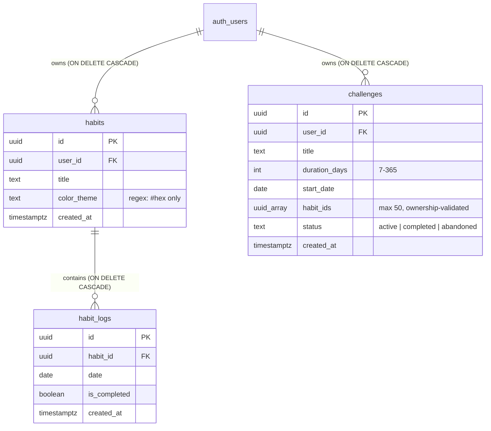

<div align="center">

# 🎯 Habit Tracker
### High-Performance Discipline Matrix & Challenge Engine

An elite, full-stack habit tracking web application engineered for daily discipline, consistency analysis, and deep focus. Built with **Next.js 16 (Turbopack & App Router)**, **React 19**, **Tailwind CSS v4**, **Framer Motion**, and **Supabase (PostgreSQL 15+)**.

[](https://nextjs.org/)
[](https://react.dev/)
[](https://www.typescriptlang.org/)
[](https://tailwindcss.com/)
[](https://supabase.com/)
[](LICENSE)

<br/>

[Features](#features) • [Tech Stack](#tech-stack) • [Architecture](#architecture) • [Getting Started](#getting-started) • [Security](#security)

</div>

---

<a id="overview"></a>
## 🌟 Overview

**Habit Tracker** moves beyond basic to-do checklists by combining a high-density **31-Day Consistency Matrix**, a rigorous **75-Day & 90-Day Challenge Engine**, and **mathematically accurate analytics** (distinguishing between Today's performance and entire Month completion). 

Whether executing **75 Hard**, entering **90-Day Monk Mode**, or building atomic daily rituals, the platform guarantees data integrity with rolling 72-hour edit windows, cross-month streak calculation, and strict database-level Row Level Security.

---

<a id="features"></a>
## ⚡ Key Features

### 🏆 1. 75-Day & 90-Day Challenge Engine
- **Structured Challenge Presets:**
  - **75 Hard / 75-Day Discipline** (75 Days of uncompromising mental grit)
  - **90-Day Monk Mode / Deep Work** (90 Days of zero distraction & intense focus)
  - **30-Day Consistency Sprint** (30 Days of rapid habit lock-in)
  - **21-Day Habit Builder** (21 Days for fundamental neurological rewiring)
  - **Custom Challenge Studio:** Define custom titles and duration from 7 to 365 days.
- **Single Active Challenge Rule:** A user cannot create a new challenge while one is active. The "Active Challenge" button opens a dedicated management modal with real-time metrics, milestone badges, enrolled habits, and options to finish or abandon before starting fresh.
- **Dynamic Countdown & Status:** Real-time day counter (`Day 1 of 90 • 89 Days Left`), with automated upcoming date detection (`Starts in X days • Day 0 of 90`).
- **Milestone Badges & Rewards:** Unlockable tiered badges:
  - 🥉 **Bronze** (25%)
  - 🥈 **Silver** (50%)
  - 🥇 **Gold** (75%)
  - 👑 **Finisher Champion** (100% with full celebratory particle confetti)
- **Habit Adherence Tracking:** Real-time adherence score measuring execution quality on elapsed days with explicit checkmark fractions (e.g., `🔥 43% Habit Adherence (3/7)`).

### 📊 2. High-Density Habit Matrix & Dual Analytics
- **31-Day Interactive Grid:** Spreadsheet-inspired matrix categorized into 5 color-coded weekly bands (Week 1 to 5).
- **Dual Accuracy Analytics:**
  - **Monthly Total:** True mathematical progress across all possible checkmarks for the month (e.g., `3 / 217 Checkmarks (7 habits × 31d) = 1% Monthly`).
  - **Today's Score:** Instant daily execution gauge (e.g., `Today: 3/7 (43%)`).
- **Continuous Cross-Month Streaks:** Streak algorithms traverse backwards across historical logs, seamlessly preserving 30+, 60+, and 100+ day unbroken streaks across month and year transitions.
- **72-Hour Integrity Lock:** Protects authentic discipline by locking checkboxes older than 72 hours (3 calendar days) and blocking future checkmarks in advance.
- **Daily Progress Wave Chart:** Smooth cubic Bézier spline visualizing day-by-day habit execution rates.
- **Top 7 Daily Leaderboard:** Real-time ranking of your most consistent routines with active flame streak indicators.

### 🧠 3. Hybrid Motivational Quote Ticker
- **33 Curated Wisdom Quotes:** Timeless mental models and quotes from Marcus Aurelius, David Goggins, Jocko Willink, James Clear, Bruce Lee, Epictetus, Kobe Bryant, Seneca, and Aristotle.
- **Calm 18-Second Auto-Shuffle:** Gentle automated quote cycle that never feels frantic.
- **Pause-on-Hover / Touch:** Instantly pauses rotation whenever the cursor hovers or fingers touch the card, preventing quotes from disappearing mid-read.
- **Smooth Cross-Fade Transitions:** Powered by Framer Motion `AnimatePresence` with custom easing.
- **Compact Quick-Shuffle:** Minimalist square-rounded `🔀` icon button with a smooth 180° spin on tap.

### 📱 4. Responsive & Touch-First Experience
- **iPad, Tablet & Mobile Perfect:**
  - Sticky habit title column (`w-[185px]` mobile / `w-[220px]` desktop) with flexbox truncation (`min-w-0 flex-1 overflow-hidden`) prevents content clipping.
  - Dedicated, permanently visible soft rose delete button (`bg-rose-500/10 text-rose-600 dark:text-rose-400`) avoids broken hover-only interactions on touchscreens.
  - 10-second touch-friendly toast confirmation window prevents accidental deletions.
- **Smooth Auth Notifications:** Non-intrusive `top-center` notifications with Apple-style cubic-bezier transitions (`cubic-bezier(0.16, 1, 0.3, 1)`) guide guest visitors to sign in without aggressive modal interruptions.

### 🎨 5. Color Studio & Theme Engine
- **Custom Color Studio:** 7 modern preset tones or any custom hex color via native color picker, hex input, eyedropper, and quick-select chips.
- **Smart Luminance Math (YIQ):** Dynamic high-contrast text color selection so light, pastel, or white habit chips remain clearly legible.
- **Ultra-Smooth Dark/Light Mode:** Zero-flicker CSS variable theme engine with ambient floating background orbs and subtle micro-dot matrix texture.

---

<a id="tech-stack"></a>
## 🛠️ Tech Stack

| Layer | Technology | Description |
| :--- | :--- | :--- |
| **Framework** | [Next.js 16.3.6](https://nextjs.org/) | App Router, React Server Components, Server Actions & Turbopack |
| **Core UI** | [React 19](https://react.dev/) | Concurrent rendering, `useActionState`, and `useTransition` |
| **Language** | [TypeScript 5](https://www.typescriptlang.org/) | End-to-end type safety across database schemas, server actions, and UI |
| **Styling** | [Tailwind CSS v4](https://tailwindcss.com/) | Next-generation CSS-first configuration with custom design tokens |
| **Animations** | [Framer Motion](https://www.framer.com/motion/) | Smooth layout transitions, modal animations, and cross-fades |
| **Database** | [Supabase PostgreSQL](https://supabase.com/) | Relational database with strict Row Level Security (RLS) & RPC functions |
| **Auth & SSR** | [@supabase/ssr](https://github.com/supabase/ssr) | Secure HTTP-only cookie-based session management |
| **Feedback & FX** | [Sonner](https://sonner.emilkowal.ski/) & [Canvas Confetti](https://github.com/catdad/canvas-confetti) | Polished toast alerts & celebratory particle bursts |
| **Icons** | [Lucide React](https://lucide.dev/) | Clean, consistent SVG icon set |

---

<a id="architecture"></a>
## 🗄️ Architecture & Database

Data is isolated using **PostgreSQL Row Level Security (RLS)** in Supabase. Every row is bound to `auth.uid() = user_id`, guaranteeing zero cross-user data leakage. A partial unique index enforces the **single active challenge per user** constraint at the database level.



### PostgreSQL Security Policies
- **`public.habits`**: Users can only `SELECT`, `INSERT`, `UPDATE`, and `DELETE` records where `user_id = auth.uid()`. Color theme column is constrained to valid hex codes via regex check constraint.
- **`public.habit_logs`**: Validates ownership via parent habit join: `EXISTS (SELECT 1 FROM habits WHERE habits.id = habit_logs.habit_id AND habits.user_id = auth.uid())`.
- **`public.challenges`**: Isolated strictly to the creator (`auth.uid() = user_id`), constrained by duration ($7 \le \text{days} \le 365$) and status (`active`, `completed`, `abandoned`). A partial unique index on `(user_id) WHERE status = 'active'` enforces one active challenge per user at the database level. A trigger (`validate_challenge_habit_ids`) ensures enrolled habit IDs belong to the same user.
- **Atomic Account Deletion RPC (`delete_user_account`)**: Allows users to permanently purge their account, habits, challenges, logs, sessions, and auth identities in a single atomic database transaction.
- **Least-Privilege Grants**: Anonymous and public roles have no table access. Only `authenticated` gets scoped DML grants. Default privileges for future tables are revoked to prevent accidental exposure.

---

<a id="getting-started"></a>
## 🚀 Getting Started

### 1. Prerequisites
- **Node.js** v20.x or higher
- **npm** or **pnpm**
- A free **[Supabase](https://supabase.com/)** project

### 2. Clone Repository
```bash
git clone https://github.com/saarthvadalia26/Habit-Tracker.git
cd Habit-Tracker
```

### 3. Install Dependencies
```bash
npm install
```

### 4. Configure Environment Variables
Create a `.env.local` file in the project root:
```env
NEXT_PUBLIC_SUPABASE_URL=https://your-project-ref.supabase.co
NEXT_PUBLIC_SUPABASE_ANON_KEY=your-supabase-anon-key
```

### 5. Initialize Database Schema
1. Navigate to your **Supabase Dashboard** -> **SQL Editor**.
2. Open [`supabase/schema.sql`](supabase/schema.sql) in this repository.
3. Paste the contents into the SQL Editor and click **Run**.
*(Tables, indexes, constraints, triggers, RLS policies, and RPC functions will be created idempotently).*

### 6. Start Development Server
```bash
npm run dev
```
Open [http://localhost:3000](http://localhost:3000) in your browser.

### 7. Build for Production
```bash
npm run build
npm run start
```

---

<a id="project-structure"></a>
## 📂 Project Structure

```plaintext
habit-tracker/
├── src/
│   ├── app/
│   │   ├── actions/               # Server Actions (Auth, Habits, Challenges)
│   │   │   ├── auth.ts            # Sign in, Sign up, Delete account, Metadata sync
│   │   │   ├── challenges.ts      # Cloud persistence for 75/90-Day challenges
│   │   │   └── habits.ts          # CRUD for habits & daily completion logs
│   │   ├── globals.css            # Tailwind v4 tokens, cubic-bezier toast curves
│   │   ├── layout.tsx             # Root layout with Geist font & ThemeProvider
│   │   └── page.tsx               # Server component page with SSR data hydration
│   ├── components/                # Modular UI Components
│   │   ├── ActiveChallengeModal.tsx # Live challenge dashboard with metrics & controls
│   │   ├── AmbientBackground.tsx  # Dynamic floating ambient orbs and dot matrix
│   │   ├── AuthModal.tsx          # Login & registration modal dialog
│   │   ├── ChallengeBanner.tsx    # Active challenge countdown, progress bar & quotes
│   │   ├── CircularGauge.tsx      # SVG progress donut gauge with responsive viewBox
│   │   ├── CreateChallengeModal.tsx # 75 Hard, 90 Monk & custom challenge creator
│   │   ├── CreateHabitModal.tsx   # Habit creation modal with custom color picker
│   │   ├── DailyProgressWaveChart.tsx # Bézier curve daily completion graph
│   │   ├── DeleteAccountModal.tsx # Account wipe confirmation dialog with typing safety
│   │   ├── HeaderNav.tsx          # Navigation header with account dropdown & theme toggle
│   │   ├── NotesSection.tsx       # User-scoped markdown notes & reflection scratchpad
│   │   ├── SmartTrackerDashboard.tsx # Comprehensive monthly matrix & analytics engine
│   │   └── ThemeToggle.tsx        # Animated Light/Dark switch
│   ├── context/
│   │   └── ThemeContext.tsx       # Fast, lag-free Light/Dark theme provider
│   ├── lib/
│   │   ├── analytics.ts           # True monthly denominator & today score algorithms
│   │   ├── challengeUtils.ts      # Presets (75 Hard, 90 Monk, 30 Sprint) & milestone math
│   │   ├── constants.ts           # Predefined themes & dynamic color resolution
│   │   ├── dateUtils.ts           # Date math, ISO formatters, rolling day windows
│   │   ├── mockData.ts            # Sample habits for guest / preview mode
│   │   ├── monthUtils.ts          # Monthly days generator, 72h rule calculations
│   │   ├── quotes.ts              # 33 curated quotes on discipline, focus & grit
│   │   ├── validation.ts          # Server-only input sanitisation (UUID, hex, email, date)
│   │   └── supabase/              # Supabase SSR clients (server, browser, and middleware)
│   ├── proxy.ts                   # Edge proxy with CSP, HSTS & security headers
│   ├── types/
│   │   ├── challenge.types.ts     # TypeScript interfaces for challenges & milestones
│   │   └── database.types.ts      # TypeScript definitions for database entities
├── supabase/
│   └── schema.sql                 # Complete idempotent PostgreSQL schema & RLS policies
├── public/                        # Static assets, multi-res favicons, and manifest
├── SECURITY.md                    # Production deployment & hardening checklist
├── LICENSE                        # MIT License
├── README.md                      # Project documentation
└── package.json
```

---

<a id="security"></a>
## 🔒 Security & Integrity

### Application-Level Protections

| Rule | Enforcement | Behavior |
| :--- | :--- | :--- |
| **Input Validation** | `src/lib/validation.ts` | All Server Action inputs are validated server-side: UUIDs, dates, hex colors, email format, and text length. No raw user strings reach the database unvalidated. |
| **Opaque Error Messages** | Server Actions | Internal database errors and provider details are never leaked to the client. Users see safe, actionable messages only. |
| **Content Security Policy** | Edge Proxy (`src/proxy.ts`) | Strict CSP with nonce-based `script-src`, `object-src 'none'`, `frame-ancestors 'none'`, and `upgrade-insecure-requests`. |
| **Security Headers** | Edge Proxy | HSTS (2 years, preload), `X-Content-Type-Options: nosniff`, `X-Frame-Options: DENY`, `Referrer-Policy: strict-origin-when-cross-origin`, restrictive `Permissions-Policy`, and COOP/CORP. |
| **Server Action Size Limit** | `next.config.ts` | Action request bodies capped at 32 KB to limit memory allocation per request. |
| **Server-Only Imports** | `server.ts`, `validation.ts` | Supabase server client and validation utilities use `import 'server-only'` to prevent accidental client bundling. |
| **Account Deletion Confirmation** | Server Action | `deleteAccountAction` requires explicit `'DELETE'` confirmation string before executing the atomic wipe RPC. |

### Database-Level Protections

| Rule | Enforcement | Behavior |
| :--- | :--- | :--- |
| **Row Level Security (RLS)** | PostgreSQL Engine | Users can strictly access, mutate, and delete only their own records. |
| **Single Active Challenge** | Partial Unique Index | `CREATE UNIQUE INDEX ... ON challenges(user_id) WHERE status = 'active'` prevents concurrent active challenges at the database level. |
| **Habit Ownership Trigger** | `validate_challenge_habit_ids()` | A `BEFORE INSERT OR UPDATE` trigger ensures challenge `habit_ids` can only reference habits owned by the same user. |
| **Hex Color Check Constraint** | `CHECK (color_theme ~ '^#...')` | Only valid 3- or 6-digit hex codes can be stored, preventing CSS injection via inline styles. |
| **Least-Privilege Grants** | Schema Permissions | `anon` and `PUBLIC` roles have zero table access. Only `authenticated` receives scoped DML grants. Default privileges for future tables are explicitly revoked. |
| **72-Hour Edit Window** | Client & Server Action | Habit cells older than 3 calendar days (72h) are locked to maintain authentic discipline. |
| **Future Date Restriction** | Client & Server Action | Blocks ticking tomorrow or any future date ahead of time. |
| **Continuous Streaks** | Analytics Engine | Preserves unbroken streaks across month and year transitions. |
| **Accurate Monthly Denominator** | Analytics Engine | Evaluates monthly percentage against total monthly capacity ($H \times D_{\text{month}}$), separating today's score. |
| **Guest Sandbox Mode** | Client State | Visitors can explore all views with instant local persistence; no server data is created. |

> For the full production hardening checklist (Supabase Auth settings, SMTP, CAPTCHA, secrets management), see [`SECURITY.md`](SECURITY.md).

---

<a id="license"></a>
## 📄 License

Distributed under the **MIT License**. See [`LICENSE`](LICENSE) for details.

---

<div align="center">
  <sub>Designed and built with discipline, focus, and precision.</sub>
</div>